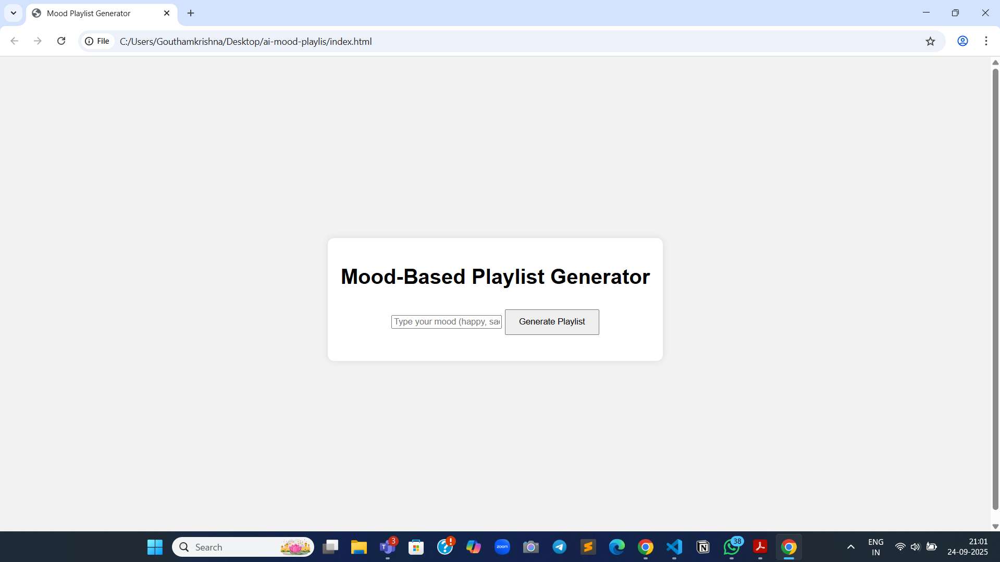
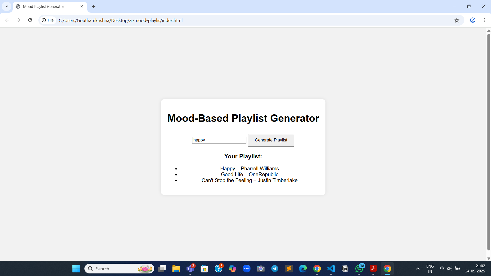

#MOOD-BASED-PLAYLIST-GENERATOR

A simple web app that generates a playlist based on the user’s mood input. Users can type moods like **happy, sad, chill, or energetic** and instantly get a curated playlist suggestion.
## Screenshots-

## 🚀 Features
- Input mood and generate a matching playlist  
- Predefined playlists for different moods  
- Clean and responsive UI  
- Simple and beginner-friendly implementation  

## 🛠️ Tech Stack
- **HTML** – structure  
- **CSS** – styling  
- **JavaScript** – playlist logic  

## ⚡ Setup Instructions
1. Clone or download this repository  
2. Open `index.html` in your browser  
3. Type a mood (e.g., *happy, sad, chill, energetic*) and click **Generate Playlist**  

Enjoy your mood-based music recommendations! 🎶
